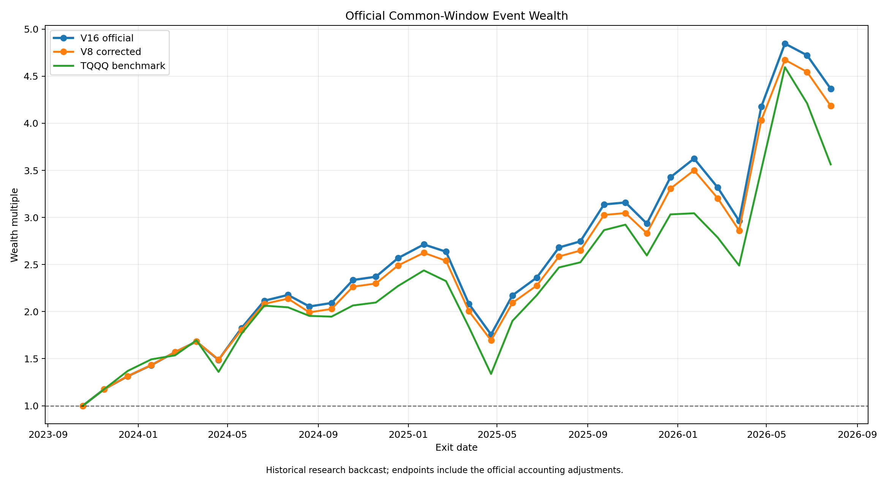

# Causal Market Allocation Research

Research code and audit artifacts for a sequence of causal US equity and ETF allocation experiments. The repository preserves the notebook pipeline through V16, the accounting corrections used for the official comparison, and compact result tables that can be reviewed without rerunning the full data pipeline.

> **Research status:** historical backtest only. V16 has not started a true out-of-sample evaluation. This repository does not provide investment advice or a production trading system.

## Canonical results

The official comparison uses the common interval from 2023-10-18 through 2026-07-27 and starts each strategy with USD 10,000.

| Strategy | Final wealth | Net return | Ending value | Event-mark max drawdown |
|---|---:|---:|---:|---:|
| V16 | 4.365780 | 336.58% | $43,657.80 | -35.26% |
| V8, corrected close ledger | 4.184169 | 318.42% | $41,841.69 | -35.44% |
| TQQQ benchmark | 3.563433 | 256.34% | $35,634.33 | -45.11% |

The values above are frozen research outputs, not expected future returns. See [docs/RESULTS.md](docs/RESULTS.md) for the accounting distinction between the original V8 result and the corrected V8 comparator.



## Repository contents

- `notebooks/research_pipeline.ipynb` is the canonical clean notebook. Outputs and execution counters are removed. Historical numbering is preserved, including legacy compatibility cells that do not follow a simple one-cell-per-module sequence.
- `pipeline_cells/` contains the notebook code as ordered Python files for easier review and diffs. The files share notebook state and are not standalone imports.
- `results/` contains compact, derived research results. Raw market data and caches are excluded.
- `docs/` explains methodology, accounting, data provenance, reproducibility, and the code review.
- `tests/test_release_integrity.py` checks notebook structure, source consistency, syntax, and frozen headline results.

For the exact publication sequence, see [docs/GITHUB_UPLOAD_GUIDE.md](docs/GITHUB_UPLOAD_GUIDE.md).

## Quick start

Create the reference environment:

```bash
conda env create -f environment.yml
conda activate market-anomaly-risk
jupyter lab notebooks/research_pipeline.ipynb
```

Run the release checks before changing the research code:

```bash
python -m unittest discover -s tests -v
```

The full notebook requires historical point-in-time inputs and local caches that are intentionally absent from this repository. Read [docs/DATA.md](docs/DATA.md) and [docs/REPRODUCIBILITY.md](docs/REPRODUCIBILITY.md) before attempting a full rerun.

## Research design

The project uses a causal signal-to-execution convention, walk-forward estimation, explicit transaction costs, point-in-time universe controls, frozen fingerprints, and exact end-state audits. V16 combines a frozen V8 core with a residual-momentum sleeve through a parameter-free universal allocation rule. See [docs/METHODOLOGY.md](docs/METHODOLOGY.md).

## Current release assessment

The research controls are stronger than the software architecture. The notebook includes causal checks, failure gates, hash validation, and detailed accounting audits. It also relies on a large shared global namespace, runtime data acquisition, local checkpoint directories, and an unpinned upstream `pitindex` installation path. These limitations make the current package suitable for a private research archive and code review. Public reproducibility requires the actions listed in [docs/PUBLICATION_CHECKLIST.md](docs/PUBLICATION_CHECKLIST.md).

## License

No license has been selected. Until a license is added, normal copyright rules apply. Choose a license before making the repository public or accepting external contributions.

## Disclaimer

See [DISCLAIMER.md](DISCLAIMER.md). Market data providers may impose separate terms. Do not commit downloaded raw data or private credentials.
